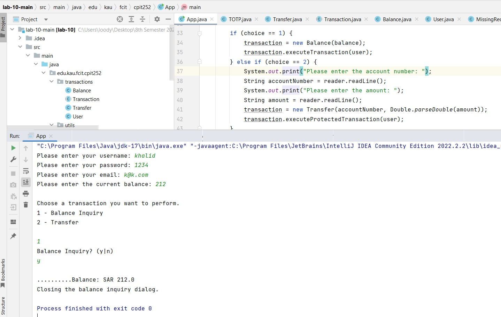
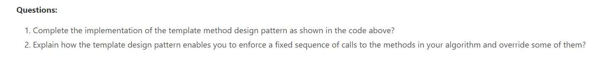

# CPIT252-Lab10-submission
This is the submission file for lab 10 activity for CPIT252

-----------

A2: It does it by having an interface or an abstract class with a final method (a method that cannot be edited or inherited), and inside this constent method are calls to other methods that may can be extended or overridden (all or some of them). The concreate subclasses override these methods and add their concreate implementation to them.

Finally, the client is only concerned with calling the content templeate methods, and the tempelate will execute everthing after that and the client is not necessarily aware of the implementaion and is hidden away from them.
